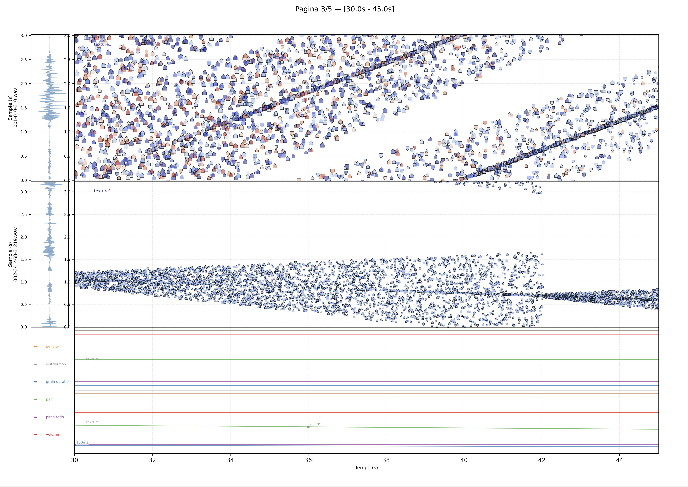

# PythonGranularEngine

A compositional environment for granular synthesis on sampled sound. The system takes a high-level YAML configuration and produces audio output and a graphic score through a fully automated pipeline.

Three components form the environment:

- **YAML DSL** — a declarative language for describing granular streams: density, multi-voice architecture, envelope trajectories on all parameters, variation strategies, dephasing, and loop control. Mathematical expressions (`(pi)`, `(10/3)`) are evaluated at parse time.
- **Graphic Score** — a time/buffer-position score generated automatically alongside the audio. Each grain is rendered as a directional arrow in the space of the source material, not in frequency space.
- **Audio Engine** — two interchangeable renderers: Csound (via `.sco` score generation) and NumPy (direct overlap-add synthesis). The same YAML configuration produces identical results from either renderer.

```
configs/*.yml
      │
      ▼
  [Python]
      │
      ├──► generated/*.sco ──► [Csound] ──► output/*.aif
      │
      ├──► output/*.aif  (NumPy renderer, no Csound required)
      │
      └──► docs/*.pdf    (graphic score, generated automatically)
```

---

## Related Tools

**[PGE-ls](https://github.com/DMGiulioRomano/PGE-ls)** — Language Server Protocol implementation for the PGE YAML DSL. Provides autocompletion, inline validation, hover documentation, and structural diagnostics directly in your editor (VSCode and any LSP-compatible client). The language server understands the full parameter schema including envelope syntax, variation strategies, and voice configurations.

---

## System Requirements

The following tools must be installed on your system before running `make setup`.

### macOS

```bash
# Install Homebrew if not present
/bin/bash -c "$(curl -fsSL https://raw.githubusercontent.com/Homebrew/install/HEAD/install.sh)"

# Install dependencies
brew install python@3.12 sox csound
```

### Linux (Debian / Ubuntu)

```bash
sudo apt update
sudo apt install -y python3.12 python3.12-venv sox csound
```

> **Note on Csound on Linux:** the version available via `apt` may be older than the one available on the [Csound website](https://csound.com/download.html). If you need a recent version, download the `.deb` package directly from the official releases.

### Arch Linux / Manjaro

```bash
curl -fsSL https://pyenv.run | bash
pyenv install 3.12
pyenv local 3.12
```

### Verify installation

```bash
make check-system-deps
```

---

## Quick Start

```bash
# 1. Clone the repository
git clone https://github.com/DMGiulioRomano/PythonGranularEngine
cd PythonGranularEngine

# 2. Install system dependencies (see above)

# 3. Setup Python virtual environment
make setup

# 4. Build the default file (generates .aif + graphic score PDF)
make all

# 5. Build a specific config file
make FILE=my-config all

# 6. Build using the NumPy renderer (no Csound required)
make FILE=my-config RENDERER=numpy all
```

---

## Score Visualization

Every build automatically generates a multi-page PDF graphic score (`docs/*.pdf`) alongside the audio file.



The score uses an unconventional representation: the **Y axis maps the position inside the source audio buffer** (in seconds), not frequency. The waveform of the source sample is displayed vertically on the left as a reading reference. This places the compositional decisions — where in the source material each grain reads from, how the reading trajectory evolves over time — directly in the visual plane, rather than representing the acoustic result.

Each grain is rendered as a directional arrow:

| Visual property | Encoded parameter |
|---|---|
| Arrow pointing up | forward reading (`pitch_ratio >= 0`) |
| Arrow pointing down | reverse reading (`pitch_ratio < 0`) |
| Arrow color | pitch ratio (coolwarm gradient) |
| Arrow opacity | volume (dB) |
| Arrow width | grain duration in time |
| Arrow height | sample consumed per grain |

When multiple streams share the same source file, they share a subplot, making their relative trajectories through the buffer immediately readable. Streams using different source files occupy separate subplots.

A lower panel displays envelope trajectories for all time-varying parameters (density, distribution, grain duration, pitch, pan, volume) for each stream visible in the time window.

Pages are 30 seconds wide in A3 landscape format. A 120-second piece produces a 4-page PDF.

---

## Project Structure

```
.
├── Makefile                      # Main entry point
├── make/
│   ├── build.mk                  # Build pipeline: YAML -> SCO/NumPy -> AIF + PDF
│   ├── test.mk                   # Virtual environment and pytest
│   ├── utils.mk                  # Open files, git sync
│   ├── audioFile.mk              # Audio file trimming via sox
│   └── clean.mk                  # Cleanup targets
├── src/
│   ├── core/                     # Grain, Stream, Cartridge, StreamConfig
│   ├── engine/                   # Generator (main orchestrator)
│   ├── rendering/
│   │   ├── score_visualizer.py   # Graphic score generator (PDF, matplotlib)
│   │   ├── numpy_audio_renderer.py   # Overlap-add synthesis renderer
│   │   ├── csound_renderer.py    # Csound .sco renderer
│   │   ├── rendering_engine.py   # Facade: renderer + mode + naming
│   │   ├── score_writer.py       # Csound score text formatting
│   │   └── stream_cache_manager.py   # SHA-256 incremental cache
│   ├── controllers/              # DensityController, PointerController, VoiceManager, ...
│   ├── parameters/               # Parameter, ParameterFactory, schema, parsing
│   ├── envelopes/                # Envelope, interpolation, time distribution
│   ├── strategies/               # Variation strategies, voice panning
│   └── shared/                   # Utils, logger, probability gates
├── csound/
│   └── main.orc                  # Csound orchestra
├── configs/                      # YAML composition files
├── refs/                         # Source audio samples
├── generated/                    # Generated .sco files (intermediate, Csound renderer)
├── output/                       # Rendered .aif files
├── docs/                         # Generated PDF scores + documentation
├── logs/                         # Csound build logs
└── tests/                        # Pytest test suite (3444 unit + 21 E2E tests)
```

---

## YAML Configuration

A minimal stream configuration:

```yaml
streams:
  - stream_id: "s01"
    onset: 0.0
    duration: 30
    sample: "source.wav"
    grain:
      duration: 0.05
```

Parameters accept multiple forms:

```yaml
# Static value
density: 10

# Linear envelope (time normalized 0.0–1.0)
density: [[0, 5], [0.5, 40], [1, 10]]

# Nested envelope (envelope of envelopes)
density: [[[0, 5], [10, 50]], 1.0, 5]

# Value + random range (±0.01)
grain:
  duration: 0.05
  duration_range: 0.01
```

Multi-voice configuration:

```yaml
voices:
  num_voices: 4
  pitch:
    strategy: chord       # step | range | chord | stochastic
    chord: "dom7"
  onset_offset:
    strategy: linear
    step: 0.08            # 80ms delay between voices
  pan:
    strategy: linear
    spread: 60.0          # stereo spread in degrees
```

Mathematical expressions are evaluated at parse time:

```yaml
grain:
  duration: (1/20)        # → 0.05
  duration_range: (pi/100)
```

---

## Make Targets

### Setup

| Command | Description |
|---|---|
| `make setup` | Full project setup: checks system deps, creates directories, sets up venv |
| `make venv-setup` | Setup Python virtual environment only |
| `make install-system-deps` | Install Csound, sox, Python via package manager |
| `make check-system-deps` | Verify system dependencies are present |

### Build

| Command | Description |
|---|---|
| `make all` | Build pipeline for the default file (`FILE=test-lez`) |
| `make FILE=name all` | Build a specific config file from `configs/name.yml` |
| `make all TEST=true` | Build all `.yml` files in `configs/` |
| `make all STEMS=true FILE=name` | Build one yml into multiple separate stem files |
| `make all STEMS=true FILE=name CACHE=true` | Incremental stem build: only re-render changed streams |
| `make FILE=name RENDERER=numpy all` | Render with NumPy (no Csound required) |

### Testing

| Command | Description |
|---|---|
| `make tests` | Run full pytest suite (3444 unit + 21 E2E tests) |
| `make tests-cov` | Run tests with HTML coverage report |
| `make e2e-tests` | Run end-to-end pipeline tests only |

The test suite covers unit tests for every module and end-to-end pipeline validation including full `YAML → Python → Csound → filesystem` runs with incremental cache behaviour.

### Utility

| Command | Description |
|---|---|
| `make open` | Open generated `.aif` files |
| `make pdf` | Open generated graphic score PDF |
| `make sync COMMIT="message"` | Git add, commit, pull, push |
| `make venv-info` | Print Python/pip/pytest versions |

### Cleanup

| Command | Description |
|---|---|
| `make clean` | Remove all generated files (`.sco`, `.aif`, logs) |
| `make clean-all` | Full cleanup including virtual environment |
| `make venv-clean` | Remove virtual environment only |
| `make clean-cache` | Remove stream fingerprint manifests |

---

## Build Flags

| Flag | Default | Description |
|---|---|---|
| `FILE` | `test-lez` | Config filename (without `.yml` extension) |
| `RENDERER` | `csound` | Audio renderer: `csound` or `numpy` |
| `AUTOKILL` | `true` | Auto-quit iZotope RX 11 before build (macOS) |
| `AUTOPEN` | `true` | Auto-open output audio file after build |
| `AUTOVISUAL` | `true` | Generate PDF graphic score alongside audio |
| `SHOWSTATIC` | `true` | Show static analysis output |
| `PRECLEAN` | `true` | Run `clean` before each build |
| `TEST` | `false` | Build all configs when `true` |
| `STEMS` | `false` | Split output into per-stream files when `true` |
| `SKIP` | `0.0` | Start time in seconds for audio trim |
| `DURATA` | `30.0` | Duration in seconds for audio trim |
| `CACHE` | `true` | Skip unchanged streams when `STEMS=true` |
| `CACHEDIR` | `cache` | Directory for stream fingerprint manifests |

Example:

```bash
make FILE=my-piece RENDERER=numpy AUTOVISUAL=true PRECLEAN=false all
```

---

## Incremental Build Cache

When building with `STEMS=true CACHE=true`, `StreamCacheManager` fingerprints each stream's YAML data (SHA-256) and skips streams whose fingerprint has not changed since the last build. Orphaned `.aif` files from removed or renamed streams are garbage-collected automatically.

This makes iterative composition on large pieces fast: only the streams you edited are re-rendered.

---

## Audio Sample Trimming

```bash
make INPUT=001 SKIP=5.0 DURATA=20.0 001-5_0-20_0.wav
```

Trims `refs/001.wav` starting at 5.0 seconds for 20 seconds using `sox` and saves to `refs/`.

---

## Platform Support

| Platform | Status |
|---|---|
| macOS (Apple Silicon / Intel) | Supported |
| Linux (Debian / Ubuntu) | Supported |
| Windows (native) | Not supported |
| Windows (WSL2) | Should work, not tested |

---

## Python Dependencies

Dependencies are managed via `pip` inside a virtual environment in `.venv/`.

```bash
make venv-reinstall   # clean venv and reinstall from requirements.txt
make venv-upgrade     # upgrade all packages to latest compatible versions
```

---

## Optional: Pin Python Version

```
# .tool-versions
python 3.12.3
```

Then run `mise install` or `asdf install`. See [mise.jdx.dev](https://mise.jdx.dev) or [asdf-vm.com](https://asdf-vm.com).